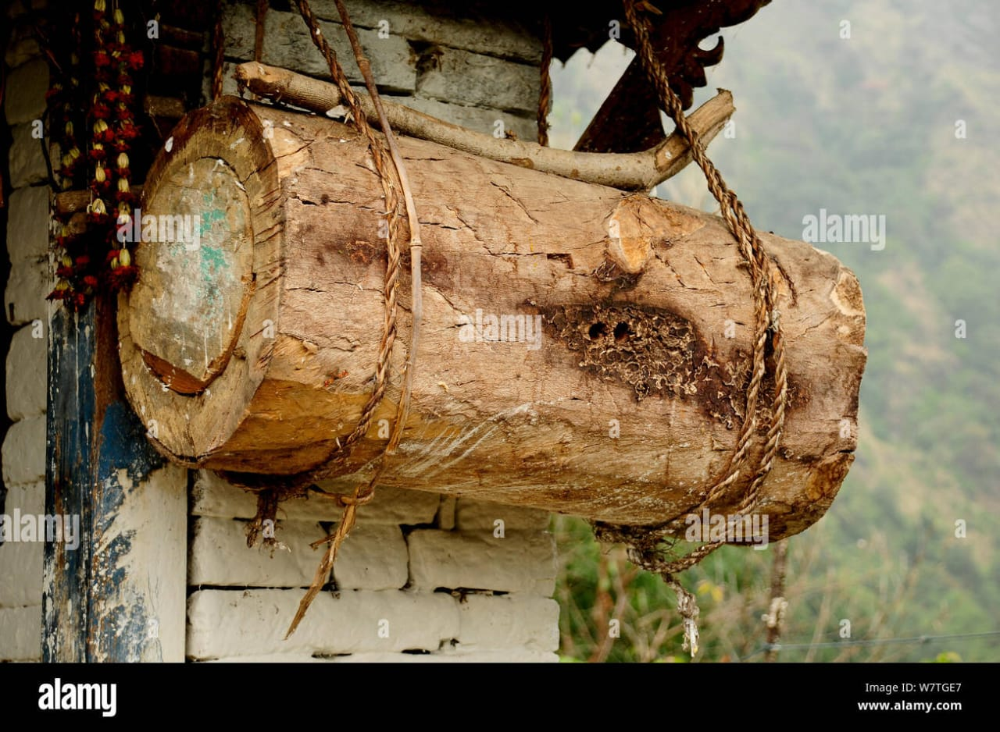
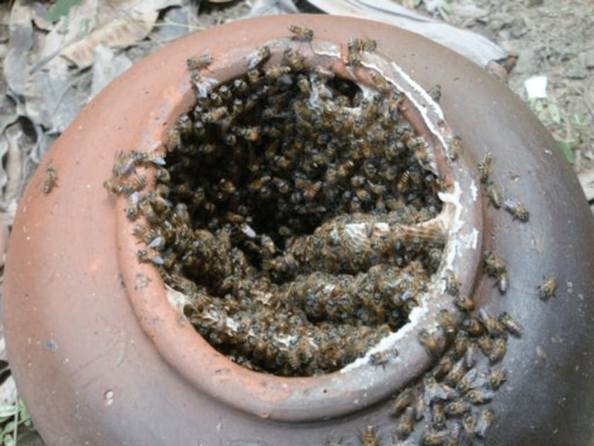
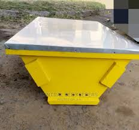
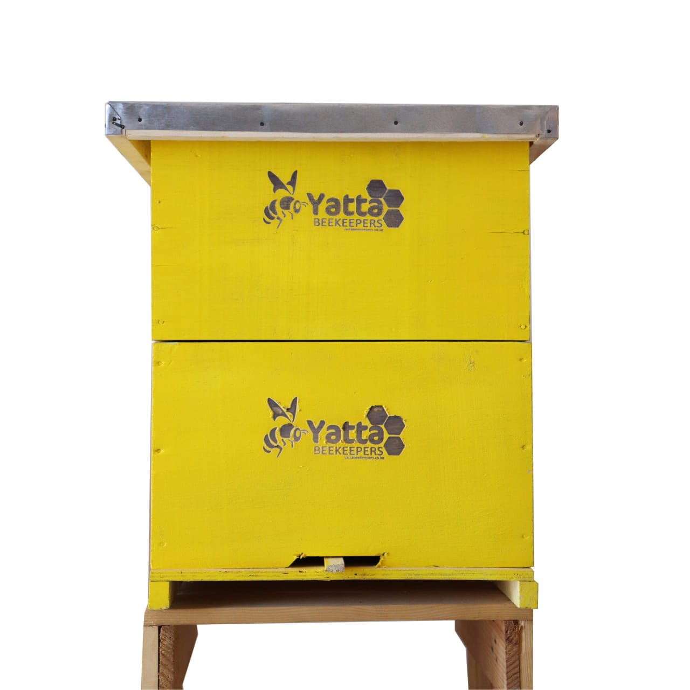

[home](https://adsfarm.github.io/)

## COMMON BEEHIVES IN KENYA

Types:
1. Traditional Hives
2. Modern Hives
   

### Traditional Hives
1. #### Log Hives

2. #### Clay-pot Hive

Not commonly used by commercial bee keepers because they have the following disadvantages:
 - Brood chamber cannot be separated from the honey chamber, leading to honey contamination with the brood.
 - Harvesting is tedious.
 - Frequent invasion by ants and pests, leading to absconding.
 - Limited insulation to temperature and humidity.
 - Increased disturbance of the colony during harvesting or maintenance.
 - Removal of combs for inspection is impossible.

### Modern Hives:

1. #### Top Bar Hives

*Advantages:*
  - Lighter.
  - Easier harvesting of honey and wax left over.
  - Better defense against attack by varroa mites and ants.

*Disadvantages:*
  - Cannot be expanded.
  - Harder to get a new colony.
  - Requires more skill and confidence by the beekeeper.
  - Higher possibility of cross-combing.
  - Easier to steal because it is light.
  - More time to reconstruct the combs and stock with honey.

2. #### Langstroth Hives

*Advantages:*
  - High honey production.
  - Possible to extract honey without destroying the combs, leading to shorter harvesting intervals.
  - Foundation and frames prevent cross-combing.
  - Fairly inexpensive.
  - Standard size of parts allows interchangeability.
  - Easy to find equipment and supplies.
  - Easier to inspect during maintenance.

   
## N.V.A
